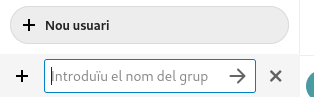
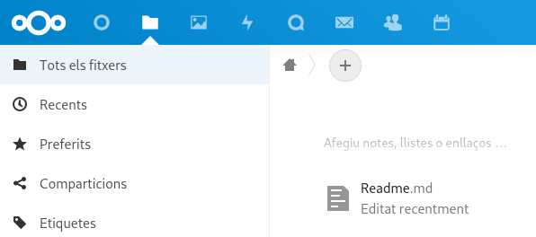

# Configuracion NextCloud

## Creación de grupos y usuarios

Para crear grupos y usuarios en el NextCloud es igual de simple que en el OwnCloud ya que unicamente hay que buscar en la parte superior derecha, dentro de la foto de perfil, la opcion usuarios.

Dentro de usuarios hay que seleccionar la cruz de la izquierda donde pone "Nuevo usuario":

Saldrá esto:

Aqui solo hay que rellenarlo y aceptar.

Para crear un grupo solo hay que escribir el nombre del nuevo grupo debajo del de crear usuarios.

## Configuración de Permisos

Para configurar los permisos hay que entrar en el apartado carpetas de arriba a la izquierda:

Para dejar que otros usuarios puedan acceder a tu carpeta hay que seleccionar la carpeta a la cual queremos poner los permis haciendo click en los ··· y seleccionar detalles, se abrirá una pestaña a la derecha y hay que seleccionar compartir, a partir de hay escribe el grupo o usuario al que quieres darle permisos sobre la carpeta.

## Administración de archivos

Para crear cualquier tipo de archivo, o subirlo, solo hay que pulsar la cruz que hay en la parte superior de la lista de carpetas y seleccionar la opción que quieras:

También puedes añadir contactos de telefono en la pestaña contactos:

Aquí solo hay que rellenar los datos.

Por ultimo tambien se puede sincronizar la cuenta de correo electronico entrando en el simbolo del sobre de la parte superior:

