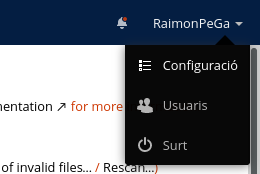
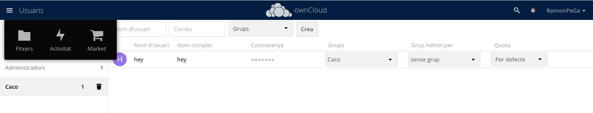
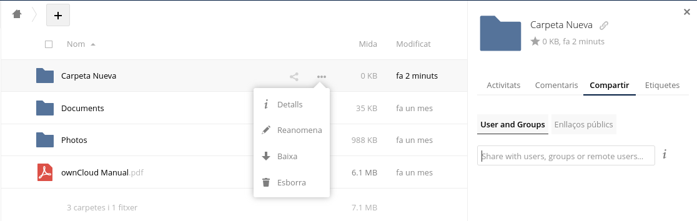
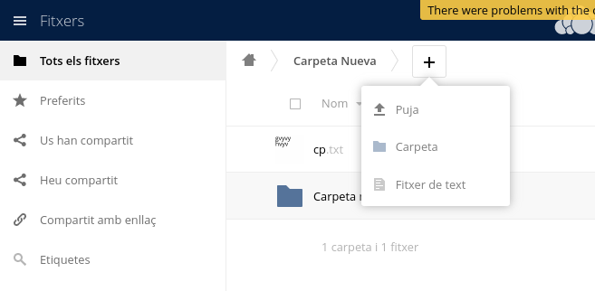
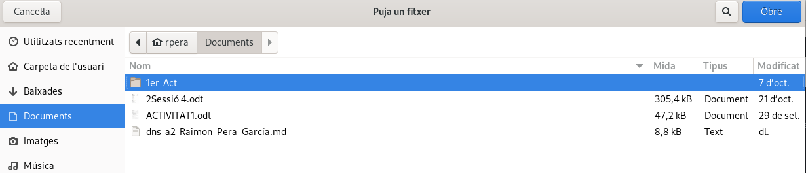

# Configuracion del OwnCloud
## Creación de usuarios y grupos

Para crear usuarios y grupos en el OwnCloud es bastante simple ya que solo hay que ir al apartado de usuarios clicando en nuestro nombre en la parte superior derecha.

A partir de aquí solo hay que rellenar la barra de arriba con el usuario y grupo que quieras crear.

## Roles y Permisos

Para agragar permisos a los grupos o usuarios sobre una carpeta hay que ir al apartado de carpetas en la parte superior izquierda.

En esta imagen podemos ver que también se puede añadir una quota de almacenaje de cada grupo o usuario.

En esta imagen podemos obserbar que podemos crear nuevas carpetas desde la cruz de arriba a la izquierda y que para añadir los permisos en la carpeta hai que seleccionar los ... de al lado de la carpeta, seleccionar detalles, después compartir y en la barra para insertar texto escribe los grupos y usuarios que desees que tengan acceso a la carpeta.

## Administración de archivos

En el OwnCloud se pueden hacer varias cosas como crear carpetas, crar archivos de texto o subir tus propios archivos al OwnCloud:

Para crear cualquier cosa hay que seleccionar la cruz que se ve en la imagen y desde hay puedes crear carpetas escribiendo el nombre que quieras, los archivos se crean de la misma forma que las carpetas y para subir un archivo que tengas guardado en tu ordenador selecciona subir, y a partir de ahi buscas el archivo que quieras.

