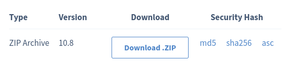

# Manual del contenedor

## Creación del contenedor

Para crear el contenedor primero usa el comando:

    lxc launch ubuntu:20.04 'nombre'

En la parte de nombre hay que poner el que se quiera.

Para iniciar hay que usar el comando:

    lxc start 'nombre'

Luego hay que ejecutar el contendor usando el comando:

    lxc exec 'nombre' /bin/bash

## Instalación de apache2, mysql y otras librerias

Ahora instalaremos todo lo necesaria para que el contenedor para que funcione usando las ordenes:

     apt update
     apt upgrade
     apt install apache2
     apt install mysql-server
     apt install php libapache2-mod-php
     apt install php-fpm php-common php-mbstring php-xmlrpc php-soap php-gd php-xml php-intl php-mysql php-cli php-ldap php-zip php-curl

## Configurar apache2

Activamos el modulo proxy_fcgi:

    a2enmod proxy_fcgi

Activamos el php-fpm:

    a2enconf php-fpm

Reiniciamos el servidor:

    systemctl restart apache2

## Configurar mysql

Dentro de mysql crear base de datos, entrando como sudo y luego mysql.

         sudo -s
         mysql
         CREATE DATABASE bbdd;

Crear un usuario y una contraseña cambiando los campos entre comillas, y localhost es donde podremos verlo poniendolo en firefox.

         CREATE USER 'usuario'@'localhost' IDENTIFIED WITH mysql_native_password BY 'password';

 Damos privilegios ha este contenedor.

         GRANT ALL ON bbdd.* to 'usuario'@'localhost';

 Finalmente salimos con exit y nos conectamos a la base de datos fuera del mysql.

         mysql -u usuario -p

## Instalar OwnCloud

Debemos descargarnos el zip con el codigo de OwnCloud.

Con el archivo /var/www/html del contenedor abierto utilizamos el comando:

    wget 'enlace de la descarga'

En este comando se llevarà el contenido de la descarga directamente al contenedor.

Después descomprimimos el contenido del zip usando:

    unzip 'nombre archivo'

Una vez descomprimido en var/www/html se aplican estos permisos.

         chmod -R 775 .
         chown -R root:www-data .
