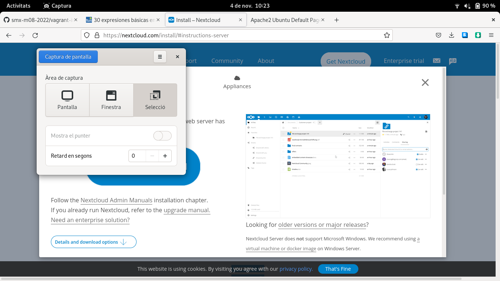

# Instalación de NextCloud
## Instalación de vagrant
Para instalar el NextCloud utilzaremos una maquina virtual de vagrant por lo qual primero hay que instalarla, las ordenes a seguir son las siguientes:

Crear un directorio para vagrant, en este caso ubuntu-focal es el nombre pero puede ser cualquiera.

    [alumne@elpuig ~]$ mkdir ubuntu-focal
    [alumne@elpuig ~]$ cd ubuntu-focal/

Crear el archivo Vagrantfile donde estará contenida la maquina virtual usando la orden vagrant init "Maquina virtual que quieras" .

    [alumne@elpuig ubuntu-focal]$ vagrant init ubuntu/focal64
    [alumne@elpuig ubuntu-focal]$ ll
    total 4
    -rw-rw-r--. 1 vcarceler vcarceler 3020 15 jul. 14:23 Vagrantfile

Ahora toca levantar la estructura de la maquina virtual

    [alumne@elpuig ubuntu-focal]$ vagrant up --provider=virtualbox

Ahora ya se puede entrar en la maquina usando vagrant ssh

## Instalar apache2, mysql y algunas librerias al contenidor

Aquí instalamos lo que va a ser necesario para posteriormente instalar el nextcloud

    apt update
    apt upgrade
    apt install -y apache2
    apt install -y mysql-server
    apt install php libapache2-mod-php
    apt install php-fpm php-common php-mbstring php-xmlrpc php-soap php-gd php-xml php-intl php-mysql php-cli php-ldap php-zip php-curl

  Ahora reiniciar el servidor apache.

      systemctl restart apache2

## Configurar mysql

Dentro de mysql crear base de datos, entrando como sudo y luego mysql.

    sudo -s
    mysql
    CREATE DATABASE bbdd;

Crear un usuario y una contraseña cambiando los campos entre comillas, y localhost es donde podremos verlo poniendolo en firefox.

    CREATE USER 'usuario'@'localhost' IDENTIFIED WITH mysql_native_password BY 'password';

Damos privilegios ha esta maquina.

    GRANT ALL ON bbdd.* to 'usuario'@'localhost';

Finalmente salimos con exit y nos conectamos a la base de datos fuera del mysql.

    mysql -u usuario -p

## Instalación de archivos del NextCloud

Hay que descargarse el codigo del NextCloud.

Después hay que llevar la carpeta zip descargada al directorio donde tienes el Vagrantfile.

Después en el propio vagrant hay que decomprimir el zip ahi mismo y borrar los restos del archivo comprimido.

    vagrant@ubuntu-focal:~$ unzip-22.2.0.zip

Una vez descomprimido en var/www/html se aplican estos permisos.

    chmod -R 775 .
    chown -R root:www-data .
